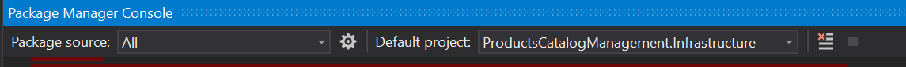
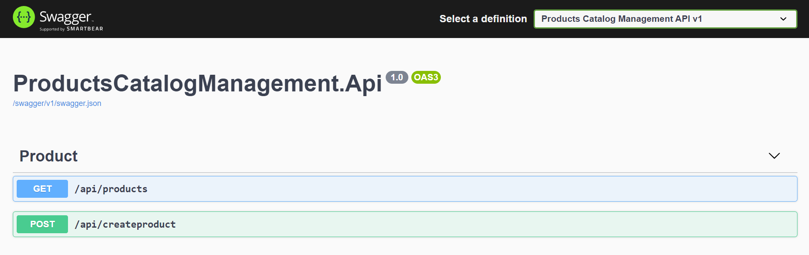

# ProductsCatalogManagement
a small ASP.NET WEB API CORE to manage products catalog.

# Stack Used
- ASP.NET Core web api 5.0
- Swagger open api specification
- Serilog 
- .Net 5.0 for Class libraries
- Entity Framework Core SqlServer - Code First

# 1 - Clone this repository 
```bash
$ git clone https://github.com/mohamedbounzaha/ProductsCatalogManagement.git
```

# 2 - Web Api : How to run the project
1 - **Update (if necessary) the database ConnectionString (ProductsCatalogManagementConnection) to target your server at :\src\ProductsCatalogManagement.Api\appsettings.json**

2 - Use Visual Studio to open **\src\ProductsCatalogManagement.sln** and set the Api project as startup project.

3 - open 'Package manager console' and set the default project  : 




 Run the command : "Update-DataBase" to create the database.
 
4 - run the project no pre-configuration needed:
    **Access this URL to browse the app :https://localhost:44366/swagger/index.html**.


    

